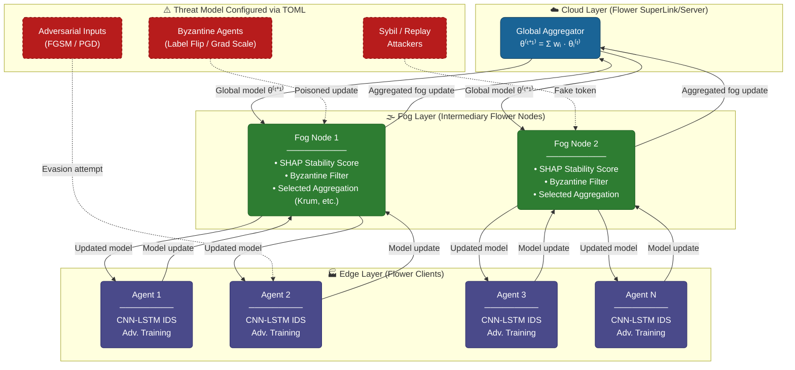

# Zero-Trust Agentic Federated Learning (Flower Implementation)

A privacy-preserving, Byzantine-resilient federated learning framework for Industrial IoT (IIoT) intrusion detection. This repository is a custom implementation of the ZTA-FL(https://arxiv.org/abs/2512.23809) framework utilizing the [Flower (flwr)](https://flower.dev/) federated learning framework. 

The system integrates device attestation concepts, SHAP-weighted robust aggregation, and on-device adversarial training into a three-tier edge–fog–cloud architecture.

---

## Overview

Traditional centralized intrusion detection systems cannot scale to IIoT deployments spanning thousands of heterogeneous edge devices across multiple industrial sites. Federated learning allows devices to collaboratively train a shared intrusion-detection model without sharing raw traffic data. However, standard FL is vulnerable to Byzantine poisoning, adversarial evasion, and Sybil attacks.

This project implements a defense-in-depth architecture using Flower's SuperLink/SuperNode topology to mitigate these threats.

---

## System Architecture



---

## Project Structure

```text
zta-fl/
├── data/                      # Raw datasets and info
│   ├── cic_ids2017/           
│   ├── edge_iiotset/          
│   └── unsw_nb15/             
├── logs/                      # Live execution logs for all network nodes
├── results/                   # JSON outputs and generated figures
├── scripts/                   # Orchestration and Evaluation Scripts
│   ├── boot_network.sh        # Main bash script to spin up the 3-tier Flower network
│   ├── plot_metrics.py        # Generates figures from JSON result logs
│   ├── verify_configs.py      # TOML validator
│   └── ...                    # Pipeline linting and verification scripts
├── src/                       # Core Implementation
│   ├── federation/            # Flower FL logic (server.py, client.py, aggregation.py)
│   ├── models/                # ML architectures (cnn_lstm.py, factory.py)
│   ├── network/               # Custom IPC routing for Cloud/Fog communication
│   ├── security/              # Threat injection (adversarial.py, backdoor.py)
│   └── utils/                 # Metrics, data loaders, compression, and logging
└── pyproject.toml             # Master configuration file (Topology, FL, Security)
```

---

## Installation

This project uses `pyproject.toml` to manage dependencies. Ensure you are using Python 3.11+.

```bash
git clone https://github.com/PanagiwthsPapadopoulos/zta-fl-flower.git
cd zta-fl-flower
python3 -m venv .venv-zta
source .venv-zta/bin/activate
pip install -e .
```

*For GPU support (recommended for larger datasets), ensure you have the appropriate CUDA version installed alongside PyTorch.*

---

## Configuration & Customization

The entire behavior of the distributed network, machine learning models, and threat environment is controlled centrally via `pyproject.toml`. 

Key sections you can modify:

* **Topology (`[tool.flwr.app.config]`):** Scale the network by adjusting `num_fogs` and `uniform_edges_per_fog`. You can even dictate custom distributions using `custom_fog_topology`.
* **Strategy:** Change the aggregation strategy by editing the `strategy` variable (e.g., `"zta"`, `"fedavg"`, `"krum"`, `"trimmed_mean"`).
* **Data Dynamics:** Control non-IID data distribution using `n_classes_per` (label skew) and `power_law_a` (quantity skew). 
* **Threat Model:** Introduce malicious agents seamlessly by adjusting the ratios under the `MULTI-VECTOR THREAT MODEL` section:
  * `label_flip_ratio = 0.2` (Turns 20% of edges into label-flippers)
  * `grad_manip_ratio = 0.1`
  * `backdoor_ratio = 0.0`
  * `pgd_ratio = 0.1`

> **Note:** Performance varies depending on your hardware specifications and the total number of nodes in the network.

---

## Datasets

Three publicly available network intrusion datasets are supported in the `data/` directory:

| Dataset | Description |
|---------|-------------|
| **Edge-IIoTset** | Traffic from IIoT devices (PLC, SCADA, Smart Sensors). |
| **CIC-IDS2017** | Network flow records from a general enterprise network. |
| **UNSW-NB15** | Network intrusion records from the UNSW cyber range. |

Configure which dataset to use by updating the `dataset` and `dataset_path` variables in `pyproject.toml`.

---

## Deploying the Distributed Network

To run the full distributed Zero-Trust architecture, we use a dynamic orchestration script that spins up the Cloud SuperLink, Fog SuperNodes/SuperLinks, and Edge SuperNodes using Flower on a single machine.

```bash
source .venv-zta/bin/activate
chmod +x scripts/boot_network.sh
./scripts/boot_network.sh
```

> 🛑 **CRITICAL WARNING: GLOBAL CONFIGURATION OVERWRITE**
> 
> In current versions of Flower, routing is managed globally via the `~/.flwr/config.toml` file. According to **[Flower Issue #6824](https://github.com/flwrlabs/flower/issues/6824)**, there is currently no native support for isolated, per-project SuperLink configurations.
> 
> Because this deployment script requires specific, dynamic port routing to orchestrate the 3-tier architecture, it **will overwrite your global `~/.flwr/config.toml` file.**
> 
> **You MUST back up your existing `~/.flwr/config.toml` before running this script** if you have other active Flower endpoints saved on your machine. The script will prompt you for confirmation before making any destructive changes.

> **Note:** Windows users must use WSL (Windows Subsystem for Linux) to run the orchestration bash scripts

> **Note:** If the process gets stuck, please cancel and restart the job.

## Deploying a Random Network

To run a distributed Zero-Trust architecture with random hyperparameters, we use a script that produces a random `pyproject.toml` file and verifies the pipeline and hyperparameter values. The old `pyproject.toml` file gets backed up and is popped when the test ends.

```bash
source .venv-zta/bin/activate
chmod +x scripts/run_local_test.sh
./scripts/run_local_test.sh
```

> **Note:** If the process gets stuck, please cancel and restart the job.

### Monitoring & Logs
The terminal displays the architecture map and then holds the process. The flow of the pipeline for the whole network written to the `logs/` directory:

```bash
# Watch the Cloud (Global convergence)
tail -f logs/system/run_cloud.log

# Watch a specific Fog (Local aggregation & Security filtering)
tail -f logs/system/run_fog1.log

# Watch an Edge Node (Local BiLSTM training & TPM Attestation)
tail -f logs/system/edge1_1_supernode.log
```
Otherwise, you can watch the pipeline update live using the following command:

```python
python3 scripts/verify_pipeline.py -w
```
> **Note:** The `logs/` directory is **wiped clean at the start of every run.** Ensure you export any critical training metrics before restarting the network.

### Stopping the Network
Since the script orchestrates multiple background processes, use `Ctrl+C` in the main terminal window. The script includes a `trap` function that will attempt to kill all child PIDs.

**If ports remain blocked**, run the following "Nuke" command:

```bash
pkill -9 -f flower-superlink && pkill -9 -f flower-supernode
```


---

## Post-Run Analysis

Once the network finishes its communication rounds, the results, including aggregated metrics and layer weights, are saved as JSON files in the `results/` directory.

You can generate visualizations (like Accuracy vs. Communication Rounds, or SHAP stability distributions) using the provided script:

* **Auto-detect latest run:** 
```
python plot_metrics.py
```
* **Plot specific run:** 
```
python plot_metrics.py results/experiment_name
```
* **Custom panels:** 
```
python plot_metrics.py --panels loss asr pgd
```

**Available Panels:** `accuracy_f1`, `loss`, `asr`, `pgd`, `fgsm`.

Generated plots will be saved to `results/experiment_name/`.

---

## Architecture Parity Report

For a detailed breakdown of how this Flower-based implementation compares to the theoretical architecture proposed in the original paper—including practical design decisions, programmatic adaptations, and security trade-offs—please refer to the **[ZTA-FL Architecture Parity Report](ZTA_FL_Architecture_Parity_Report.md)** included in this repository.

---

## Acknowledgments and References

This repository is built using the open-source **Flower** federated learning framework:
* [Flower (flwr) GitHub Repository](https://github.com/adap/flower)
* [Flower Official Documentation](https://flower.dev/)

The architecture, logic, and experimental design implemented here are derived from the original **ZTA-FL** paper. If this architecture and methodology helps your research, please refer to and cite the original authors:

```bibtex
@article{singh2025ztafl,
  title   = {Zero-Trust Agentic Federated Learning for Secure {IIoT} Defense Systems},
  author  = {Singh, Samaresh Kumar and Roy, Joyjit and So, Martin},
  journal = {arXiv preprint arXiv:2512.23809},
  year    = {2025},
  url     = {https://arxiv.org/abs/2512.23809},
}
```

## License

This project is licensed under the MIT License - see the [LICENSE](LICENSE) file for details.