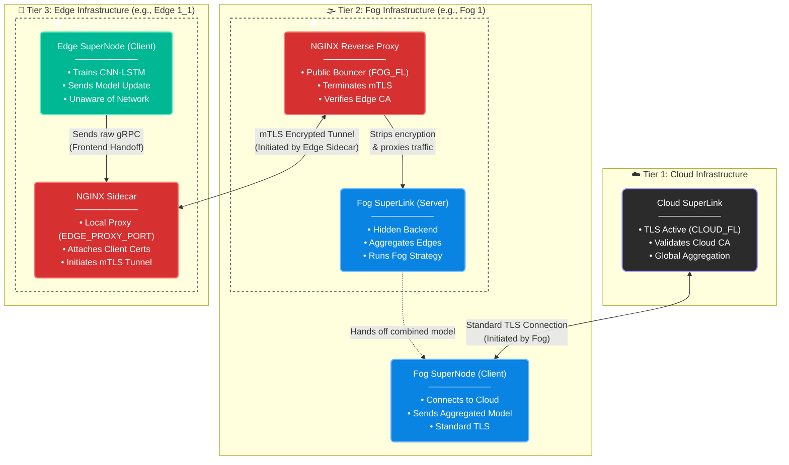

# ZTA-FL: Architecture & Implementation Parity Report

This document provides a comprehensive architectural comparison between the theoretical design proposed in the paper *"Zero-Trust Agentic Federated Learning for Secure IIoT Defense Systems"* and the provided Python implementation. 

It highlights matching components, defends specific engineering decisions made to realize the paper's claims in code, and catalogs the missing architectural elements that are slated for future implementation.

---

## 1. Hierarchical Topology (Edge-Fog-Cloud)

### Paper Specification
The system utilizes a 3-tier structure consisting of Edge Agents training local models, Fog nodes verifying attestation tokens and executing regional aggregation, and a Cloud Layer performing Global Coordination. `PDF`

### Code Implementation
*   **Files Implemented:** [`src/entrypoints/server.py`](src/entrypoints/server.py), [`src/entrypoints/client.py`](src/entrypoints/client.py), [`src/tier_fog/fog_bridge_server.py`](src/tier_fog/fog_bridge_server.py), [`src/tier_edge/fog_bridge_client.py`](src/tier_edge/fog_bridge_client.py), [`src/shared/network/ipc.py`](src/shared/network/ipc.py). 
*   **Implementation Reality:** Standard federated learning frameworks (like Flower) natively support only 2-tier client-server topologies. To achieve parity with the paper's 3-tier architecture, the codebase implements custom Inter-Process Communication (IPC) TCP sockets bridging the Edge and Fog. Fog nodes execute a localized socket listener (`FogBridgeServer`) to intercept and aggregate Edge weights, whilst simultaneously acting as standard FL clients connected to the top-tier Cloud Layer.

## 2. Zero-Trust Attestation Protocol

### Paper Specification
Edge agents generate a cryptographic token encompassing their ID, a timestamp, Platform Configuration Register (PCR) measurements, and a random nonce, all signed by a hardware Trusted Platform Module (TPM). The Fog layer validates this signature alongside freshness and PCR state, while utilizing a TrustDB to quarantine agents falling below a $\tau_{min} = 0.6$ score threshold (enforcing a 0.5 score penalty for failures and requiring 5 consecutive clean attestations for rehabilitation).

### Code Implementation
*   **Files Implemented:** [`src/tier_edge/tpm_attestation.py`](src/tier_edge/tpm_attestation.py), [`src/tier_fog/tpm_verifier.py`](src/tier_fog/tpm_verifier.py), [`src/tier_fog/trust_db.py`](src/tier_fog/trust_db.py), [`src/tier_fog/gatekeeper.py`](src/tier_fog/gatekeeper.py).
*   **Implementation Reality:** True hardware-rooted attestation is achieved by executing direct OS-level subprocess calls to `tpm2-tools` utilities (`tpm2_quote`, `tpm2_checkquote`, `tpm2_print`). The token consists of the unique hardware identifier of the TPM's public key name property (ID), a Base64-encoded binary message generated by the TPM which includes the nonce and PCR value, a Base64-encoded cryptographic signature produced by the TPM hardware to verify the integrity of the quote and a timestamp. The `TrustDatabase` class maintains strict parity with the paper's policy: implementing `INIT_SCORE = 0.7`, `MIN_THRESHOLD = 0.6`, applying a `PENALTY_MULTIPLIER = 0.5`, and requiring a `RECOVERY_REQUIREMENT = 5` streak before lifting a quarantine. 

## 3. SHAP-Weighted Robust Aggregation

### Paper Specification
Fog nodes calculate SHAP stability scores to identify Byzantine outliers. Any agent yielding a score below $\mu_s - 2\sigma_s$ is filtered. Valid updates are aggregated via weights calculated from the agent's SHAP stability, validation accuracy, and dataset size. A sanity check reverts the global model to the previous round if aggregated accuracy drops below 80%. 

### Code Implementation
*   **Files Implemented:** [`src/tier_fog/shap_verifier.py`](src/tier_fog/shap_verifier.py), [`src/tier_fog/fog_aggregator.py`](src/tier_fog/fog_aggregator.py), [`src/shared/utils/metrics.py`](src/shared/utils/metrics.py).
*   **Implementation Reality:** Explainability is derived utilizing the `GradientShap` method from the `captum.attr` library against a randomly sampled background validation dataset. The filtering threshold $\mu_s - 2\sigma_s$ is calculated using Median Absolute Deviation (MAD) over raw standard deviation to ensure resilience against extreme outliers, specifically assigning $\sigma_s = max(mad * 1.4826, 1e-5)$. The dynamic rollback mechanism is accurately implemented in `_evaluate_rollback_sanity_check`, which caches the PyTorch `state_dict` and mathematically verifies if accuracy falls beneath the parameterized `rollback_threshold` (defaulted at 0.80). 

## 4. On-Device Adversarial Training

### Paper Specification
Edge agents execute privacy-protecting adversarial training by partitioning their local datasets into a 70% clean and 30% adversarial subset. Adversarial examples are actively generated utilizing Fast Gradient Sign Method (FGSM) or Projected Gradient Descent (PGD).

### Code Implementation
*   **Files Implemented:** [`src/tier_edge/local_ids.py`](src/tier_edge/local_ids.py), [`src/shared/security/adversarial_math.py`](src/shared/security/adversarial_math.py), [`src/tier_edge/byzantine_simulator.py`](src/tier_edge/byzantine_simulator.py).
*   **Implementation Reality:** The `_apply_static_adversarial_split` method isolates a specific percentage of the active tensor batch governed by the configurable `adv_ratio` parameter. The `pgd_attack` and `fgsm_attack` functions calculate the PyTorch computational graph gradients using `F.cross_entropy`, extract the mathematical sign (`x_to_attack.grad.sign()`), and inject the designated $\epsilon$ budget. The codebase extends the paper's specification by utilizing an autonomous `AdversaryManager` to dynamically load multi-vector threat profiles (e.g., label flipping, model poisoning, PCR alteration) mapping directly onto specific physical edge node identities.

## 6. Network Encryption - TLS & mTLS

### Paper Specification
The paper mentions mutual TLS for fog-edge communication but does not specify for cloud-fog communication, so standard TLS was assumed.

### Code Implementation
*   **Files Implemented:** [`scripts/setup/setup_nginx.py`](scripts/setup/setup_nginx.py), [`scripts/setup/setup_security.py`](scripts/setup/setup_security.py).
* This implementation completely offloads network security from the application layer. The Flower nodes are intentionally isolated from cryptographic operations. **NGINX** handles all mutual TLS (mTLS) enforcement, certificate validation, and encrypted routing.

#### 1. Cloud-to-Fog Boundary (Standard TLS)
The Cloud operates as the global aggregator, secured behind a standard TLS boundary.
* **Ingress:** The Cloud SuperLink listens on a public port secured by a central `Cloud Root CA`.
* **Authentication:** Fog SuperNodes connect upwards as standard clients, verifying the Cloud's certificate before sending any payloads.

#### 2. Fog-to-Edge Boundary (mTLS Reverse Proxy)
The Fog layer acts as the absolute security perimeter for incoming Edge traffic.
* **The Bouncer (NGINX Proxy):** All Edge connections hit the public NGINX port (`FOG_FL`). NGINX aggressively intercepts traffic, demands an `edge_client.crt`, and verifies it against the `Edge Root CA`. Invalid certificates are instantly dropped.
* **The Backend (Fog SuperLink):** If verified, NGINX strips the TLS 1.3 encryption and funnels the raw, unencrypted gRPC data to the isolated Fog SuperLink listening on a hidden internal port (`FOG_INTERNAL_FL`).

#### 3. Edge Egress (mTLS Sidecar)
Edge agents train locally and securely egress data without knowing the network topology.
* **Insecure Handoff:** The Edge SuperNode dumps raw gRPC traffic to a local loopback port (`EDGE_PROXY_PORT`).
* **Encrypted Egress (NGINX Sidecar):** The local NGINX Sidecar intercepts this raw traffic, wraps it in heavy TLS 1.3 encryption, stamps it with the agent's unique cryptographic identity, and tunnels it to the Fog.

#### Secure Data Lifecycle
1. **Emit:** Edge application pushes raw data to local `127.0.0.1`.
2. **Encrypt & Sign:** Edge Sidecar wraps the payload in mTLS and fires it over the public network.
3. **Intercept & Verify:** Fog Proxy catches the payload, verifies the Edge CA signature, and decrypts it.
4. **Process:** Fog Proxy routes the naked gRPC data to the internal aggregator.

