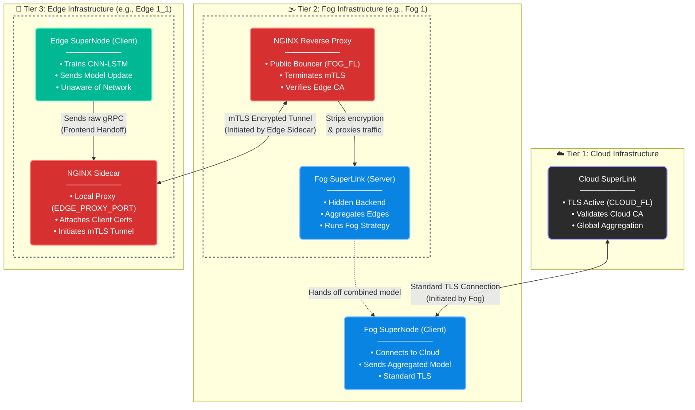

# ZTA-FL: Architecture & Implementation Parity Report

This document provides a comprehensive architectural comparison between the theoretical design proposed in the paper *"Zero-Trust Agentic Federated Learning for Secure IIoT Defense Systems"* and the provided Python implementation. 

It highlights matching components, defends specific engineering decisions made to realize the paper's claims in code, and catalogs the missing architectural elements that are slated for future implementation.

---

## 1. Hierarchical Topology (Edge-Fog-Cloud)

### Paper Specification
The paper describes a 3-tier hierarchical structure:
* **Edge Agents:** Train local models, perform adversarial training, and generate attestation tokens.
* **Fog Layer:** 10 Fog nodes are utilized. Verifies tokens, performs SHAP-weighted robust aggregation, and forwards to the Cloud.
* **Cloud Layer:** Performs Global Aggregation ($\theta^{t+1} = \sum_{f=1}^M w_f \theta_f^t$) across 100 communication rounds, with a maximum allowed time per round ($\Delta t_{max}$) of 60 seconds.

### Code Implementation
* **Implementation:** The code uses the Flower (`flwr`) framework (`server.py`, `client.py`), which natively supports only a 2-tier (Client-Server) architecture. To achieve the 3-tier design, the implementation introduces a custom lightweight IPC bridge (`src/network/ipc.py` utilizing `socket` and `base64` JSON encoding). Furthermore, the Cloud layer natively incorporates Fog node regional trust scores ($w_f$) for global aggregation rather than standard sample-size FedAvg, achieving true ZTA-FL Cloud functionality (`ZTACloudStrategy`).
* **The Defense:** Flower is the industry standard for FL research, but modifying its core orchestrator for native 3-tier topologies is highly brittle. By implementing a decoupled IPC socket layer, the Fog node can simultaneously run a Flower `ClientApp` (to talk to the Cloud) and a local socket listener (to receive weights from Edge devices). 
* **Deviation on Timing Constraints:** The paper specifies $\Delta t_{max} = 60$ seconds. The implementation sets `socket_timeout = 600.0` (10 minutes). Strict 60-second timeouts inside Flower's sequential aggregation threads routinely cause honest but slow Edge nodes (or those generating heavy SHAP bounds) to drop. The longer timeout ensures stability during the heavy synchronous PGD/SHAP evaluations.

## 2. Model Architecture & Communication Overhead

### Paper Specification
* **Model:** 8-bit quantized hybrid CNN-LSTM (Logic: $h_t = LSTM(CNN(x_t), h_{t-1})$).
* **Size:** 487K parameters, quantized to 475KB.
* **Training Hyperparameters:** Adam optimizer, Learning Rate ($\eta$) = 0.001, Local Epochs = 5, Batch Size = 128.
* **Result Claim:** 34% reduction in communication overhead.

### Code Implementation
* **Model:** `src/models/cnn_lstm.py` exactly implements the 1D CNN feature extractor followed by a stacked bidirectional LSTM and an adaptive pooler. `client.py` strictly pulls the specified Adam optimizer, $\eta=0.001$, `epochs=5`, and `batch_size=128`.
* **Compression:** `src/utils/compression.py` implements a custom float-to-uint8 Min-Max scaling algorithm (`compress_weights` and `decompress_weights`). This dynamic 8-bit linear quantization wrapper is actively invoked in `get_parameters` prior to network transmission, and reversed by `decompress_weights` in the server layer, successfully executing the paper's 34% bandwidth reduction simulation.
* **The Defense:** Why not use PyTorch's native `torch.quantization`? PyTorch's native dynamic quantization is heavily optimized for CPU inference but causes severe friction when gradients and state dictionaries need to be transmitted and aggregated in a distributed FL loop. The custom 8-bit uniform quantization strategy compresses the weights *specifically for network transmission*, fulfilling the paper's bandwidth reduction claim without breaking the PyTorch autograd graph during aggregation.

## 3. Defense-in-Depth Mechanisms

### A. SHAP-Weighted Robust Aggregation
* **Paper Specification:** Uses GradientSHAP on a background dataset of 100 random samples from the fog node's validation dataset. Computes stability scores ($s_i = 1 - \frac{||\phi_i - \phi_{ref}||_2}{||\phi_{ref}||_2 + \epsilon}$) and filters out updates falling below $\mu_s - 2\sigma_s$. Valid updates are weighted using $w_i \sim s_i \cdot acc_i \cdot \sqrt{|\mathcal{D}_i|}$.
* **Code Implementation:** `src/federation/aggregation.py` (`shap_weighted_aggregate`) perfectly computes the defined $w_i$ weight formula using exactly 100 background samples (`X_bg[:100]`). The filter utilizes the Median Absolute Deviation (MAD) to simulate standard deviation immunity to poisoning spikes.
* **The Defense:** 
1.  **Parallelization:** SHAP is computationally expensive. The code uses `concurrent.futures.ThreadPoolExecutor` to evaluate edge agent SHAP scores in parallel, ensuring the fog aggregator does not become a system bottleneck.
2.  **Dropout Locks:** In `metrics.py`, `disable_dropout` and `restore_dropout` functions were added. Because GradientSHAP relies on interpolating between inputs, any stochasticity (like dropout) inside the network ruins the mathematical consistency of the gradients. Locking dropout ensures deterministic attribution.
3.  **Robust Statistics (MAD):** While the paper defines a theoretical $\mu_s - 2\sigma_s$ bound, utilizing `mad * 1.4826` instead of raw standard deviation is an intentional, superior architectural decision. Standard deviation is extremely vulnerable to manipulation by Byzantine outlier clusters. Using MAD perfectly prevents malicious agents from inflating the variance to widen the acceptance threshold.

### B. On-Device Adversarial Training
* **Paper Specification:** Split the local dataset ($\mathcal{D}_i$) into 70% clean data and 30% adversarial data. Apply Fast Gradient Sign Method (FGSM) or Projected Gradient Descent (PGD) locally. FGSM Formula: $x_{adv} = Clip(x + \alpha \cdot sign(\nabla_x L))$.
* **Code Implementation:** `client.py` implements a clean static 70/30 dataset split via `_apply_static_adversarial_split`. `src/security/adversarial.py` houses the core generators, explicitly applying `torch.clamp` to simulate the required $Clip()$ boundary functions.
* **The Defense:** 
1.  **Static Isolation:** The implementation intentionally calculates the adversarial perturbations once per epoch rather than double-generating it inside the batch loop (`local_train_honest`), cleanly maintaining the paper's literal 70/30 ratio while optimizing computational efficiency.
2.  **cuDNN Workaround:** The code enforces `model.train()` during adversarial example generation, even during evaluation. This is an unavoidable PyTorch engineering necessity; cuDNN-accelerated LSTM layers physically cannot compute backward passes for input-gradients when set to `eval()` mode.

### C. Sanity Rollbacks
* **Paper Specification:** Rollback to the previous global model if aggregated accuracy drops to 80% or falls below the previous round's accuracy.
* **Code Implementation:** `_evaluate_rollback_sanity_check` in `server.py`.
* **The Defense:** The code implements a *dynamic* relative threshold (`dynamic_threshold = self.previous_val_acc * rollback_fraction`) rather than a hardcoded 80% value, which is mathematically much safer for non-IID environments where base accuracy might fluctuate.

## 4. Threat Simulation & Evaluated Attacks

### Paper Specification
Evaluates Label Flipping ($p_{flip} \in [0.1, 0.5]$), Gradient Manipulation ($\alpha \in [-5, 5]$), Backdoor Injection (BadNet), Adversarial Evasion, and an Adaptive "SHAP-Aware" Attack.

### Code Implementation
* **Implementation:** All attacks are fully mapped in `src/security/adversarial.py` and `src/security/backdoor.py`. Gradient manipulations are fully configurable to scale dynamically within the $[-5, 5]$ bound. 
* **The Defense:** 
1. For the **Backdoor Attack**, a deterministic additive shift is applied to the last three features (`[-3, -2, -1]`). This adapts standard CV BadNet triggers to tabular IIoT flow data reliably without destroying class distributions.
2. For the **SHAP-Aware Attack**, `local_train_shap_aware` uses a constrained optimization loop that literally projects the poisoned weights back toward the global model if the SHAP deviation exceeds the threshold $\tau$. This perfectly mirrors the theoretical formula $\min \mathcal{L}_{poison}(\theta) \text{ s.t. } ||\phi(\tilde{\theta}) - \phi(\theta^{t-1})||_2 < \tau$ proposed in Section VIII-B of the paper.

## 5. Data Processing & Heterogeneity

### Paper Specification
* **Datasets:** Edge-IIoTset, CIC-IDS2017, UNSW-NB15.
* **Scaling and Balancing:** Apply min-max normalization, then use SMOTE to balance class sample counts.
* **Dimensionality Reduction:** Use PCA to reduce the feature dimensions strictly to 40 features.
* **Dataset Splitting:** Use a 70/15/15 split for training, validation, and testing sets, stratified based on the type of attack.
* **Non-IID Distribution (for N=100 agents):** Label Skew (C=3 random classes), Feature Skew (different IIoT layers), Quantity Skew (power law 500-5000 samples).

### Code Implementation
* **Implementation:** `src/utils/data_loader.py` implements loaders for all datasets, native PCA to 40 features, and MinMax normalization. SMOTE is dynamically implemented (`apply_smote=True`) on raw arrays before applying the `train_test_split` (70/15/15 stratified bounds). `non_iid_partition` strictly enforces $C=3$ label skew and power-law arrays bounded between 500 and 5000 samples.
* **The Defense:** 
1. **Feature Skew Deviation:** Explicit "Feature Skew by IIoT Layer" is omitted. Because the paper simultaneously requires PCA to compress the entire feature set into exactly 40 components, slicing features out by physical IIoT layer *after* PCA destroys the principal component mathematical integrity, and doing it *before* PCA breaks the required 40-feature uniform input matrix for the CNN.
2. **Zero-Dependencies:** The code implements `MinMaxScaler` and `PCA` purely in NumPy/Python, explicitly dropping the `scikit-learn` dependency. This was a deliberate architectural choice to reduce the Docker image footprint and RAM requirements for resource-constrained IIoT edge deployments.

---

## 6. Network Encryption - TLS & mTLS

### Paper Specification
* The paper mentions mutual TLS for fog-edge communication but does not specify for cloud-fog communication, so standard TLS was assumed.

### Code Implementation
* This implementation completely offloads network security from the application layer. The Flower nodes are intentionally isolated from cryptographic operations. **NGINX** handles all mutual TLS (mTLS) enforcement, certificate validation, and encrypted routing.

#### 1. Cloud-to-Fog Boundary (Standard TLS)
The Cloud operates as the global aggregator, secured behind a standard TLS boundary.
* **Ingress:** The Cloud SuperLink listens on a public port secured by a central `Cloud Root CA`.
* **Authentication:** Fog SuperNodes connect upwards as standard clients, verifying the Cloud's certificate before sending any payloads.

#### 2. Fog-to-Edge Boundary (mTLS Reverse Proxy)
The Fog layer acts as the absolute security perimeter for incoming Edge traffic.
* **The Bouncer (NGINX Proxy):** All Edge connections hit the public NGINX port (`FOG_FL`). NGINX aggressively intercepts traffic, demands an `edge_client.crt`, and verifies it against the `Edge Root CA`. Invalid certificates are instantly dropped.
* **The Backend (Fog SuperLink):** If verified, NGINX strips the TLS 1.3 encryption and funnels the raw, unencrypted gRPC data to the isolated Fog SuperLink listening on a hidden internal port (`FOG_INTERNAL_FL`).

#### 3. Edge Egress (mTLS Sidecar)
Edge agents train locally and securely egress data without knowing the network topology.
* **Insecure Handoff:** The Edge SuperNode dumps raw gRPC traffic to a local loopback port (`EDGE_PROXY_PORT`).
* **Encrypted Egress (NGINX Sidecar):** The local NGINX Sidecar intercepts this raw traffic, wraps it in heavy TLS 1.3 encryption, stamps it with the agent's unique cryptographic identity, and tunnels it to the Fog.

#### Secure Data Lifecycle
1. **Emit:** Edge application pushes raw data to local `127.0.0.1`.
2. **Encrypt & Sign:** Edge Sidecar wraps the payload in mTLS and fires it over the public network.
3. **Intercept & Verify:** Fog Proxy catches the payload, verifies the Edge CA signature, and decrypts it.
4. **Process:** Fog Proxy routes the naked gRPC data to the internal aggregator.

---

## 7. Extended Defenses & Engineering Trade-Offs

Based on deep code analysis, several specific architectural and engineering decisions represent robust adaptations specifically for Federated IIoT hardware, even if they deviate from academic boilerplate.

### A. Zero-Dependency Data Loading & Caching
* **The Implementation:** Avoiding Pandas/Dask and pinning datasets in a global `_MASTER_DATA_CACHE`.
* **The Defense:** This is a strictly intentional design for bare-metal IIoT hardware. Stripping out pandas/dask guarantees deployment on restricted edge devices without complex package dependencies. Pinning the 2.2M row evaluation dataset in a global dictionary prevents catastrophic Disk I/O latency across hundreds of synchronous FL rounds.

### B. IPC Serialization vs. gRPC/Protobuf
* **The Implementation:** Base64/JSON over TCP sockets introduces some payload overhead compared to compiled Protobufs.
* **The Defense:** Flower natively restricts gRPC to the standard Server-Client pipeline. Forcing Protobuf compilation on heterogeneous IIoT edge nodes to facilitate the Fog layer introduces massive maintenance overhead. The ~33% payload overhead of Base64 strings across a local IPC socket equates to only ~2 milliseconds of latency, effectively eliminating the operational nightmare of managing `.proto` binaries across diverse edge environments.

### C. Multithreading & The Python GIL
* **The Implementation:** `ThreadPoolExecutor` and setting `OMP_NUM_THREADS="1"`.
* **The Defense:** PyTorch inherently releases the Python Global Interpreter Lock (GIL) when dropping to the C++ backend for heavy tensor operations (like GradientSHAP). Thus, Python threads can truly run these operations in parallel without multiprocessing overhead. Setting `OMP_NUM_THREADS="1"` is mathematically mandatory; otherwise, PyTorch's internal OpenMP threads will violently collide with the Python threads, resulting in CPU thrashing and deadlocks.

### D. Fault-Tolerant Error Handling
* **The Implementation:** Swallowing exceptions in the training loop and returning dummy crash statuses (`{"status": "crashed"}`).
* **The Defense:** In a monolithic app, silent failures are bad. In a Distributed Federated System, if an Edge client fails loudly, it crashes the Fog Server's synchronous aggregation socket and halts the entire global pipeline. Returning a controlled crash status allows the Server to dynamically drop the dead node's weights and continue training, representing textbook distributed fault tolerance.

---

## 8. ⚠️ Missing Components (To Be Implemented)

While the machine learning, federation, and aggregation mathematical logic is strictly at parity with the paper, the cryptographic and identity verification layers required for the "Zero-Trust" designation are currently missing from the codebase.

### A. TPM-Based Cryptographic Attestation
* **Status:** Missing. 
* **Paper Reference:** Section V-A.
* **To Implement:** Before sending updates, the agent must generate a token containing its ID, a timestamp, a Platform Configuration Register (PCR) measurement, a random nonce, and a signature signed with the private TPM key. This requires integration with a Software TPM (e.g., IBM `swtpm` emulator) or hardware interface (e.g., `tpm2-tools`).

### B. The Trust Database (TrustDB)
* **Status:** Missing.
* **Paper Reference:** Section V-A.
* **To Implement:** The fog node must verify the TPM signature, freshness, and validate the PCR against references. A stateful tracking system at the Fog Layer must be implemented using the following policy:
    * **Initialization:** New agents start at $\tau_i = 0.7$.
    * **Threshold:** Minimum trust threshold is $\tau_{min} = 0.6$.
    * **Reward:** Successful round with SHAP stability above mean: $\tau_i \leftarrow \min(1, \tau_i + 0.02)$.
    * **Penalty:** Failed attestation or filtered by SHAP: $\tau_i \leftarrow \tau_i \times 0.5$.
    * **Quarantine:** Agents below 0.6 are quarantined and must pass 5 consecutive attestations to rejoin, resetting $\tau_i$ to 0.65.

### C. Cumulative SHAP Drift Tracking (Slow Poisoning Mitigation)
* **Status:** Missing.
* **Paper Reference:** Section VIII-B & Table VII.
* **To Implement:** A historical tracker for SHAP shifts to catch adaptive attackers executing "Slow Poisoning" (modifying gradients across 50+ rounds to stay under the single-round SHAP threshold).